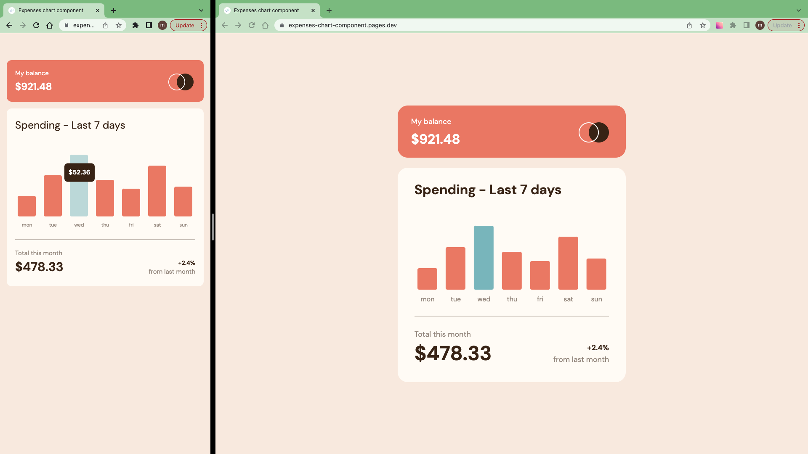

# Frontend Mentor - Expenses chart component solution

This is a solution to the [Expenses chart component challenge on Frontend Mentor](https://www.frontendmentor.io/challenges/expenses-chart-component-e7yJBUdjwt).

## Table of contents

- [Overview](#overview)
  - [The challenge](#the-challenge)
  - [Screenshot](#screenshot)
  - [Links](#links)
- [My process](#my-process)
  - [Work time](#work-time)
  - [Built with](#built-with)
  - [Useful resources](#useful-resources)
- [Author](#author)
- [Acknowledgments](#acknowledgments)

## Overview

### The challenge

Users should be able to:

- View the bar chart and hover over the individual bars to see the correct amounts for each day
- See the current day’s bar highlighted in a different colour to the other bars
- View the optimal layout for the content depending on their device’s screen size
- See hover states for all interactive elements on the page
- **Bonus**: Use the JSON data file provided to dynamically size the bars on the chart

### Screenshot

### Links

- Solution: [frontendmentor.io](https://www.frontendmentor.io/solutions/?)

- Live Site: [cloudflare](https://?.dev/)

## My process

- 1.Download assets, Install Vite & TailwindCss, Initialize git, README.md, Prepare project, ...
- 2.Create Expenses chart component
- 3.Prepare and Publish(Write README.md, Push to github, Make it live on Cloudflare, Publish to frontendmentor, ...)

### Work Time

- [My Clockify Report](https://app.clockify.me/shared/?)

### Built with

- [React](https://react.dev/)
- [TailwindCss](https://tailwindcss.com/)
- [Nivo bar chart] (https://nivo.rocks/bar/)

### Useful resources

- [Nivo chart](https://nivo.rocks/)

## Author

- Frontend Mentor - [@siavhnz](https://www.frontendmentor.io/profile/siavhnz)

- github - [@siavhnz](https://www.github.com/siavhnz)

## Acknowledgments

Thanks To

[Frontendmentor.io](https://www.frontendmentor.io/challenges) - for their Excitement challenges  

[Perfect Pixel](https://chrome.google.com/webstore/detail/perfectpixel-by-welldonec/dkaagdgjmgdmbnecmcefdhjekcoceebi?hl=en) - for such a great extension
